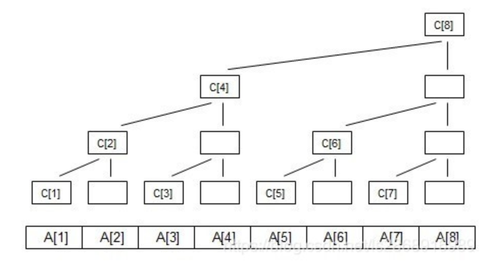
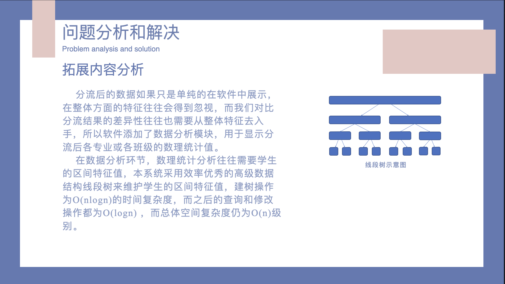
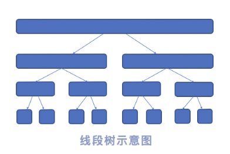

# 算法讲堂

*****

## 树状数组

树状数组是一个查询和修改复杂度都为$O(logn)$的数据结构。主要用于数组的**单点修改**和**区间查询**。

关于树状数组的存储结构其实只有一个处理数组。（ $a$ 为原数组，$tr$ 为处理后数组，$n$ 为数据范围）

```C++
long long a[N], tr[N], n;
```

接下来，介绍 $lowbit$ 操作，该操作返回当前数组二进制下最后的 “1” 所在的位置。

 ```C++
 inline void lowbit(int x) {
 	return x & -x;
 }
 ```

 修改操作

```C++
inline void add(int pos, long long x) {
	for (long long i = pos; i <= n; i += lowbit(i)) tr[i] += x;
}
```

查询操作

```C++
long long getSum(long long x) {
	long long rs = 0;
	for (long long i = x; i; i -= lowbit(i)) rs += tr[i];
	return rs;
}
```

感谢CSDN上萧何山大佬博客 [树状数组详解](https://blog.csdn.net/ls2868916989/article/details/119268741) 中的图：



$tr[i]$ 代表子树的叶子节点的权值之和，如图可以知道：

$tr[1]=A[1];$
$tr[2]=A[1]+A[2];$
$tr[3]=A[3];$
$tr[4]=A[1]+A[2]+A[3]+A[4];$
$tr[5]=A[5];$
$tr[6]=A[5]+A[6];$
$tr[7]=A[7];$
$tr[8]=A[1]+A[2]+A[3]+A[4]+A[5]+A[6]+A[7]+A[8];$

**单点修改**就是对每个包含该节点的树状数组节点进行更新，通过 $+=lowbit(i)$ 向上维护。
**区间查询**则是通过将 $[1, (所求下标)]$ 这个区间依据**二进制**划分后相加求解。

## 线段树

树状数组实现了 $O(logn)$ 级别的区间查询和单点修改操作，但是如果我们需要**区间修改/查询操作**的时候，应该怎么办呢？

当然是线段树，伟大的线段树之神会赐福于一切的数据维护。





线段树定义：

```C++
long long w[N], n, m;
struct Node {
	int l, r;
	long long sum, add;
} tr[N << 2];
```

pushup操作：

```C++
void pushup(int u) {
	tr[u].sum = tr[u << 1].sum + tr[u << 1 | 1].sum;
}
```

build操作：

```C++
void build(int u, int l, int r) {
	if (l == r) tr[u] = {l, r, w[l], 0};
	else {
		tr[u] = {l, r};
		int mid = l + r >> 1;
		build(u << 1, l, mid), build(u << 1 | 1, mid + 1, r);
		pushup(u);
	}
}
```

